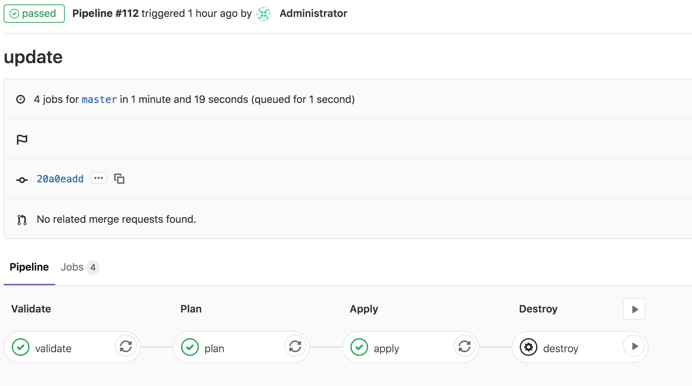
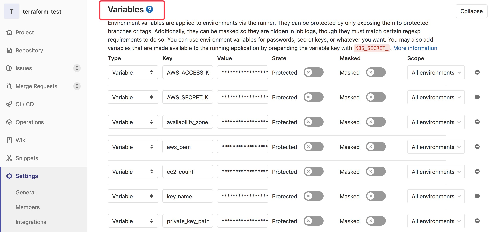

# Terraform Devops.
This is a terraform test code that implements the following features.

- A VPC. include a subnet, route table, and internet gateway.
- An EC2 instance, running a web server
- This use AWS Free Tier instance
- An Application Load Balancer targeting the EC2 instance.(http://minaalb-65473996.ap-southeast-2.elb.amazonaws.com/)
- All the resouces use modules and input/output variables
- EC2 instances can only access through 22 port
- Can modify EC2 instances count through variable setting and trigger ci/cd pipeline

# How to  deploy

## CI/CD automatic deploy

# GitlabCI [](http://3.88.51.197/root/terraform_test/pipelines)

http://3.88.51.197/root/terraform_test/pipelines (This is my personal Gitlabci)

I created a ci/cd pipeline to automatically deploy terraform code, set github webhook, once there's a push action happened,it will trigger automatic deployment.



Including verificate, plan, apply, and for destroy, I set the manual trigger. So destroy action won't trigger automatically.

About the variable  set in the gitlabci settings variable for safe keeping




## Manual deploy

If you don't want to use ci/cd, also can deploy it manually.         

**Deploy code By manually**

If you don't want to use ci/cd tools can deploy it by manually.

```bash
$ git clone https://github.com/shiboyan/terraform_test.git
$cd terraform_test
```
Create a file name xxx.tfvars, For example:
auto-demo.tfvars

```
# aws-demo.tfvars
environment = "dev"
key_name= "minaterraform"
ec2_count = 2 //number of ec2
private_key_path="./minaterraform.pem"
subnet_cidrs = ["10.172.1.0/24", "10.172.2.0/24"]
availability_zone = ["ap-southeast-2a", "ap-southeast-2b"]

```

```bash
$ terraform init
$ terraform validate -var-file=aws-demo.tfvars
$ terraform apply -var-file=aws-demo.tfvars
```

If you don't need aws resources, can destroy them.

```bash
$ terraform destroy
```


## License


